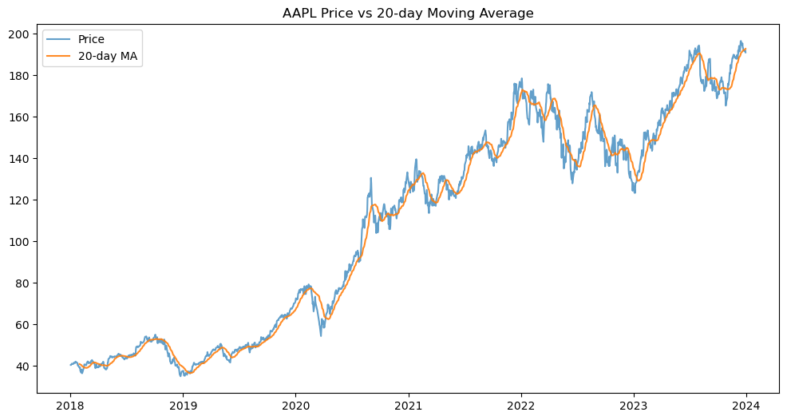

# SP500 Financial ML Analysis
End-to-end financial data pipeline analyzing S&P 500 stocks with Python, machine learning, and MySQL integration. Includes preprocessing, feature engineering, time series analysis, predictive modeling, and SQL-based risk-return reporting.

S&P 500 Financial ML Analysis
This repository presents an end-to-end financial data pipeline for analyzing S&P 500 stocks using Python, machine learning, and MySQL integration. The project walks through the full workflow of financial data analysis:

-Data ingestion using yfinance and structured datasets.
-Preprocessing and feature engineering (handling missing values, scaling, moving averages, rolling volatility).
-Time series analysis to confirm stationarity and identify market trends.
-Machine learning modeling with Logistic Regression and Random Forest to predict daily stock price movements.
-Trading strategy evaluation, comparing ML-based predictions to a buy-and-hold benchmark.
-SQL integration to compute risk-return metrics and perform structured analysis on stock performance and volatility.

This project highlights both analyst skills (data cleaning, visualization, SQL queries) and data science capabilities (predictive modeling, feature importance, comparative strategy evaluation).

## Repository Structure
- `Finance Dashboard Rough Template.ipynb` → Jupyter Notebook with the full analysis pipeline.  
- `Finance Dashboard Project.sql` → MySQL queries with comments for reproducible analysis.  
- `visuals/` → Key charts and plots generated during the project.  
- `requirements.txt` → Python dependencies for reproducibility.  
- `README.md` → Project documentation.  

## Technologies Used
- **Python**: pandas, numpy, scikit-learn, matplotlib, statsmodels, yfinance  
- **SQL**: MySQL with SQLAlchemy for integration  
- **Visualization**: Matplotlib  
- **Environment**: Jupyter Notebook  

## Visuals

| Price with Moving Average | Buy & Hold vs Model Strategy |
|---------------------------|-------------------------------|
|  |  |


## Example SQL Queries
```sql
-- Average daily return by stock
SELECT Symbol, ROUND(AVG(`Return`), 6) AS avg_return
FROM sp500_stocks
GROUP BY Symbol
ORDER BY avg_return DESC;

-- Volatility ranking
SELECT Symbol, ROUND(STDDEV_SAMP(`Return`), 6) AS volatility
FROM sp500_stocks
GROUP BY Symbol
ORDER BY volatility DESC;

-- Stock-specific inspection (AAPL)
SELECT Date, Price, ROUND(`Return`, 6) AS daily_return, 
       ROUND(MA_20, 6) AS MA_20, ROUND(Vol_20, 6) AS Vol_20
FROM sp500_stocks
WHERE Symbol = 'AAPL'
ORDER BY Date ASC
LIMIT 20;
